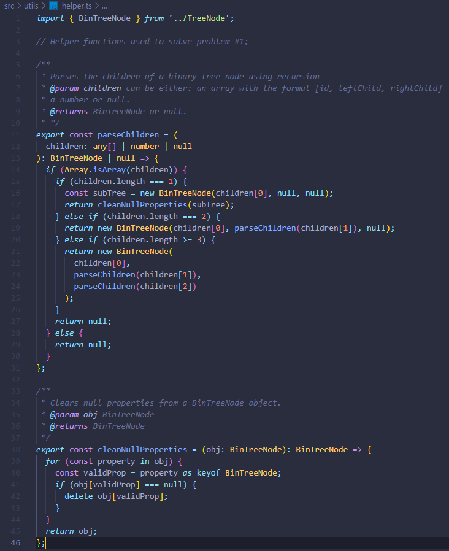
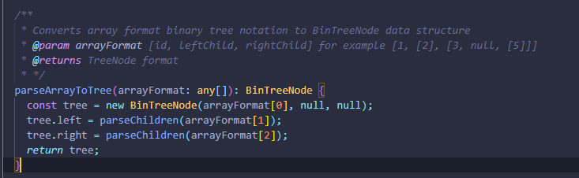
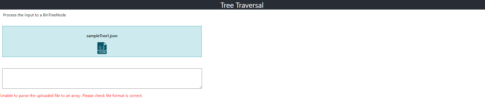
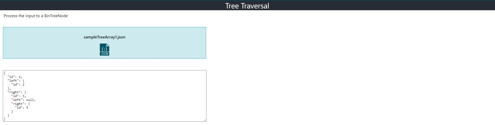
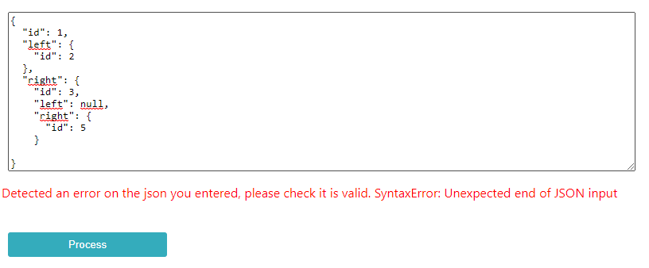
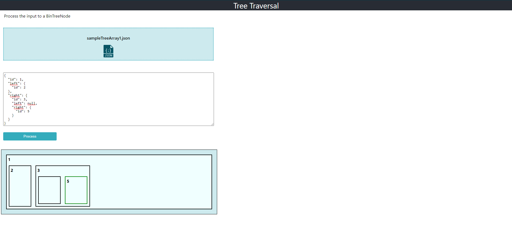
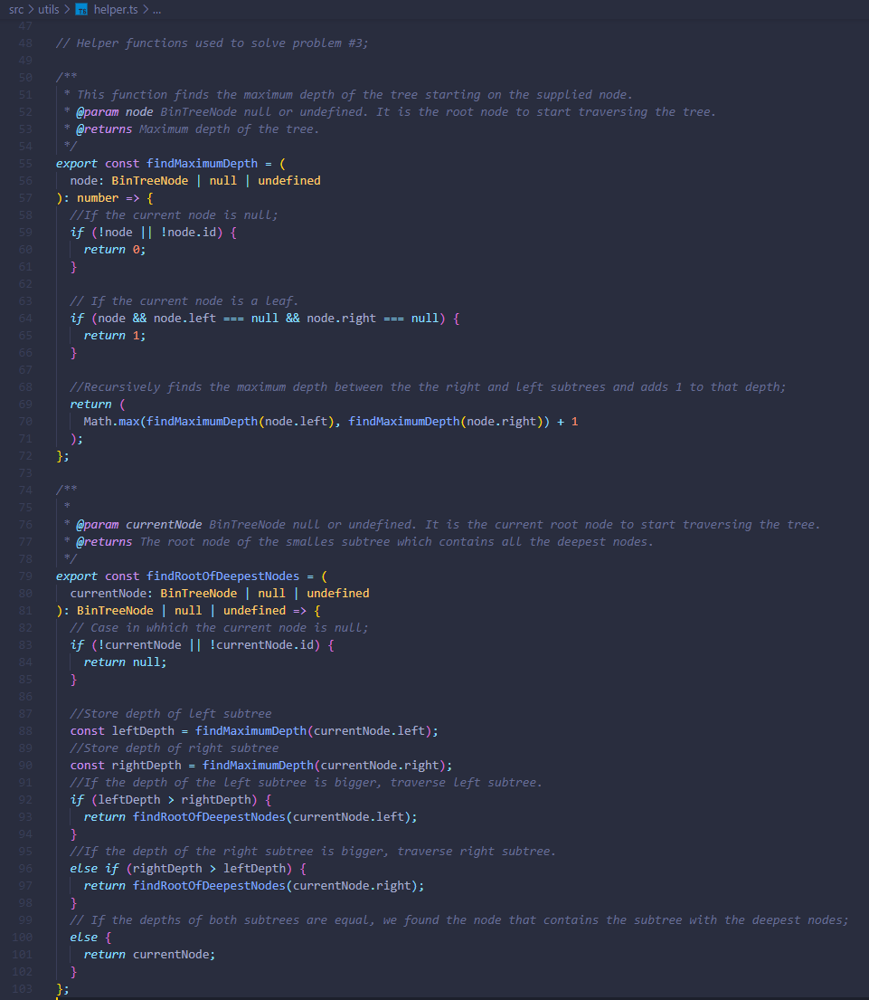
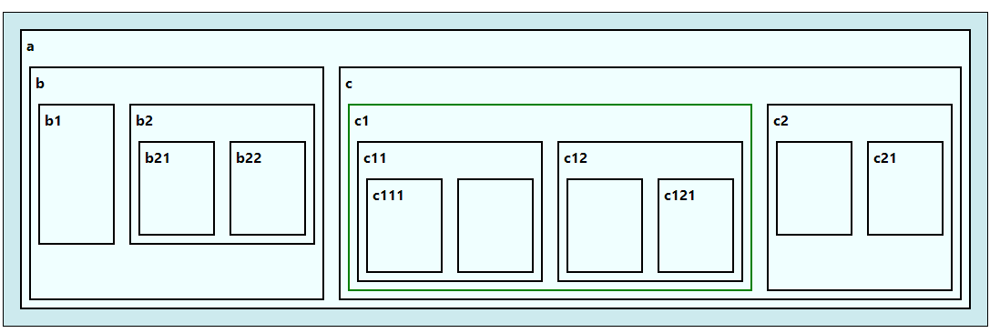

# React MS Interview

## Project Description

This project was made as an interview test. It solves 3 different problems related to the binary tree data structure and the algorithms to traverse it, using Typescript. It also involves using React to create a visual web experience. I used the base code example provided and built upon it to achieve the solution to the problems.

---

## Problem 1

Implement a function in JavaScript or Typescript that takes an array as input with format: [id, leftChild, rightChild], and parse this array into a binary tree data structure.

You can find the code related to this problem in src/utils/helper.ts and src/TreeInput.tsx  
On the helper.ts file you will find two functions. parseChildren and cleanNullproperties:

As you can see, the parseChildren function uses recursion to parse the children of a Binary Tree node, it handle several cases according to the received children.

1. Case #1: If the children is an array of length 1: it creates a new BinTreeNode with children[0] as the root.
2. Case #2: If the children is an array of length 2: creates a new BinTreeNode with children[0] as the root, calls the function recursively for the left children, using the current node's left child as argument, and sets the right child as null.
3. Case #3: If the children is an array of length 3: creates a new BinTreeNode with children[0] as the root and calls the function recursively for both left children and right children, using the current node's respective left or right child as argument.

In all other cases it returns null. And the clear null properties is simply used as a helper to clear properties that are null.

Both of these functions are used on the parseArrayToTree function in src/TreeInput.tsx to parse the tree from a valid input array:

---

## Problem 2

The objective of problem 2 was to create a web experience with react, in which the user could upload a Json file with an array as input. The array has the same format as the one problem #1. This array must be parsed to a tree structure and:

- The parsed tree must be shown in a text area.
- There is an "Output" section which displays the parsed tree in a virtual format.
- Users can edit the JSON text and when the users click process, if the JSON is valid, the ouput will update.

To solve this problem I created a new **file upload** component which can find under components/file-upload/FileUpload.tsx. This component allows the user to load a new json file with the array which will be used as input.
You can use any of the sampleTreeArray#.json files included in the /src folder to test it.

If the uploaded JSON file isn't a valid array, it will display the following validation message:

But, if the json is a valid array, the app will parse it and display the text in the text area:

The user can now edit the parsed tree in the text area, and click the "process" button to display the visual output if the json is valid. But if the user is editing the json and it has an error, the following validation error message will be shown:

Finally, if the file is valid, the visual output will be shown to the user. You can find the css for the visual output under src/TreeOutput.scss:

---

## Problem 3

For the problem 3 the objective was to find the smallest subtree with all the despest nodes and set its border to 2px solid green.

The functions used to solve this problem are findMaximumDepth and findRootOfDeepestNodes. You will also find them under src/utils/helper.ts

Both this functions are used to find the node the is the root of the smallest subtree with the deepest nodes. I use the findRootOfDeepestNodes on the Body.tsx file and pass the result as props to the TreeOutput.tsx component on the nodeToHighlight prop. This is the result:

---

## Ideas that could be implemented to improve the project:

I have several ideas which could be used to improve this project both from a user and a dev standpoint:

1. Refactor the whole app to use functional components with hooks instead of class components.

2. I would improve the structure of the files in the project. For example I would put the main components of the app inside a /modules folder. And the shared components that can be re-used in several places I would place them inside the /components folder. Each component would have it's own folder with the .tsx and the .scss files. This would improve the order and maintainability of the code.

3. I would improve the validation of the inputs the user can insert by validating the json against a schema.

4. (Personal preference) Change the state management library from Mobx to Context API or Redux. Even though, in this case maybe a state management library isn't needed at all, so local state could be used as well.

---

 

## Create React App

This project was bootstrapped with [Create React App](https://github.com/facebook/create-react-app).

## Available Scripts

In the project directory, you can run:

### `yarn start`

Runs the app in the development mode. 
Open [http://localhost:3000](http://localhost:3000) to view it in the browser.

The page will reload if you make edits. 
You will also see any lint errors in the console.

### `yarn test`

Launches the test runner in the interactive watch mode. 
See the section about [running tests](https://facebook.github.io/create-react-app/docs/running-tests) for more information.

### `yarn build`

Builds the app for production to the `build` folder. 
It correctly bundles React in production mode and optimizes the build for the best performance.

The build is minified and the filenames include the hashes. 
Your app is ready to be deployed!

See the section about [deployment](https://facebook.github.io/create-react-app/docs/deployment) for more information.

### `yarn eject`

**Note: this is a one-way operation. Once you `eject`, you can’t go back!**

If you aren’t satisfied with the build tool and configuration choices, you can `eject` at any time. This command will remove the single build dependency from your project.

Instead, it will copy all the configuration files and the transitive dependencies (Webpack, Babel, ESLint, etc) right into your project so you have full control over them. All of the commands except `eject` will still work, but they will point to the copied scripts so you can tweak them. At this point you’re on your own.

You don’t have to ever use `eject`. The curated feature set is suitable for small and middle deployments, and you shouldn’t feel obligated to use this feature. However we understand that this tool wouldn’t be useful if you couldn’t customize it when you are ready for it.

## Learn More

You can learn more in the [Create React App documentation](https://facebook.github.io/create-react-app/docs/getting-started).

To learn React, check out the [React documentation](https://reactjs.org/).
